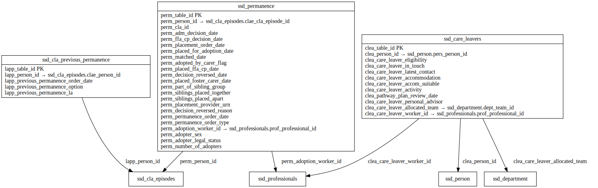

# CARE_LEAVERS ERD

[View full image](../assets/images/erd_care_leavers.svg)  |  [Download SVG](../assets/images/erd_care_leavers.svg)  |  [Download DOT file](../dot/erd_care_leavers.dot)

## Table Field Previews

**Tables in domain:** 3

<strong>ssd_care_leavers</strong>

<table>
<thead>
<tr><th>Field</th><th>Type</th><th>Notes</th></tr>
</thead>
<tbody>
<tr><td>clea_table_id</td><td>nvarchar</td><td>PK</td></tr>
<tr><td>clea_person_id</td><td>nvarchar</td><td>FK → ssd_person</td></tr>
<tr><td>clea_care_leaver_eligibility</td><td>nvarchar</td><td></td></tr>
<tr><td>clea_care_leaver_in_touch</td><td>nvarchar</td><td></td></tr>
<tr><td>clea_care_leaver_latest_contact</td><td>datetime</td><td></td></tr>
<tr><td>clea_care_leaver_accommodation</td><td>nvarchar</td><td></td></tr>
<tr><td>clea_care_leaver_accom_suitable</td><td>nvarchar</td><td></td></tr>
<tr><td>clea_care_leaver_activity</td><td>nvarchar</td><td></td></tr>
<tr><td>clea_pathway_plan_review_date</td><td>datetime</td><td></td></tr>
<tr><td>clea_care_leaver_personal_advisor</td><td>nvarchar</td><td></td></tr>
<tr><td>clea_care_leaver_allocated_team</td><td>nvarchar</td><td>FK → ssd_department</td></tr>
<tr><td>clea_care_leaver_worker_id</td><td>nvarchar</td><td>FK → ssd_professionals</td></tr>
</tbody>
</table>

<strong>ssd_cla_previous_permanence</strong>

<table>
<thead>
<tr><th>Field</th><th>Type</th><th>Notes</th></tr>
</thead>
<tbody>
<tr><td>lapp_table_id</td><td>nvarchar</td><td>PK</td></tr>
<tr><td>lapp_person_id</td><td>nvarchar</td><td>FK → ssd_cla_episodes</td></tr>
<tr><td>lapp_previous_permanence_order_date</td><td>nvarchar</td><td></td></tr>
<tr><td>lapp_previous_permanence_option</td><td>nvarchar</td><td></td></tr>
<tr><td>lapp_previous_permanence_la</td><td>nvarchar</td><td></td></tr>
</tbody>
</table>

<strong>ssd_permanence</strong>

<table>
<thead>
<tr><th>Field</th><th>Type</th><th>Notes</th></tr>
</thead>
<tbody>
<tr><td>perm_table_id</td><td>nvarchar</td><td>PK</td></tr>
<tr><td>perm_person_id</td><td>nvarchar</td><td>FK → ssd_cla_episodes</td></tr>
<tr><td>perm_cla_id</td><td>nvarchar</td><td></td></tr>
<tr><td>perm_adm_decision_date</td><td>datetime</td><td></td></tr>
<tr><td>perm_ffa_cp_decision_date</td><td>datetime</td><td></td></tr>
<tr><td>perm_placement_order_date</td><td>datetime</td><td></td></tr>
<tr><td>perm_placed_for_adoption_date</td><td>datetime</td><td></td></tr>
<tr><td>perm_matched_date</td><td>datetime</td><td></td></tr>
<tr><td>perm_adopted_by_carer_flag</td><td>nchar</td><td></td></tr>
<tr><td>perm_placed_ffa_cp_date</td><td>datetime</td><td></td></tr>
<tr><td>perm_decision_reversed_date</td><td>datetime</td><td></td></tr>
<tr><td>perm_placed_foster_carer_date</td><td>datetime</td><td></td></tr>
<tr><td>perm_part_of_sibling_group</td><td>nchar</td><td></td></tr>
<tr><td>perm_siblings_placed_together</td><td>int</td><td></td></tr>
<tr><td>perm_siblings_placed_apart</td><td>int</td><td></td></tr>
<tr><td>perm_placement_provider_urn</td><td>nvarchar</td><td></td></tr>
<tr><td>perm_decision_reversed_reason</td><td>nvarchar</td><td></td></tr>
<tr><td>perm_permanence_order_date</td><td>datetime</td><td></td></tr>
<tr><td>perm_permanence_order_type</td><td>nvarchar</td><td></td></tr>
<tr><td>perm_adoption_worker_id</td><td>nvarchar</td><td>FK → ssd_professionals</td></tr>
<tr><td>perm_adopter_sex</td><td>nvarchar</td><td></td></tr>
<tr><td>perm_adopter_legal_status</td><td>nvarchar</td><td></td></tr>
<tr><td>perm_number_of_adopters</td><td>nvarchar</td><td></td></tr>
</tbody>
</table>

