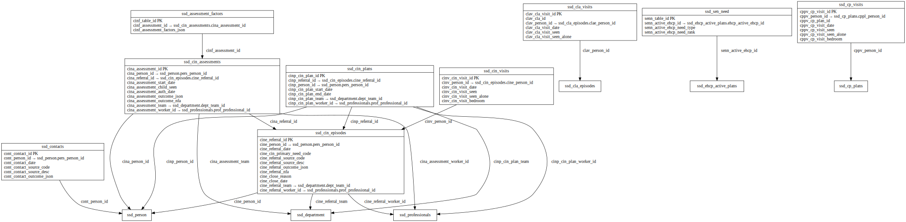

# CIN ERD

[View full image](../assets/images/erd_cin.svg)  |  [Download SVG](../assets/images/erd_cin.svg)  |  [Download DOT file](../dot/erd_cin.dot)

## Table Field Previews

**Tables in domain:** 14

<strong>ssd_assessment_factors</strong>

<table>
<thead>
<tr><th>Field</th><th>Type</th><th>Notes</th></tr>
</thead>
<tbody>
<tr><td>cinf_table_id</td><td>nvarchar</td><td>PK</td></tr>
<tr><td>cinf_assessment_id</td><td>nvarchar</td><td>FK → <a href="#ssd_cin_assessments">ssd_cin_assessments</a></td></tr>
<tr><td>cinf_assessment_factors_json</td><td>nvarchar</td><td></td></tr>
</tbody>
</table>

<strong>ssd_cin_assessments</strong>

<table>
<thead>
<tr><th>Field</th><th>Type</th><th>Notes</th></tr>
</thead>
<tbody>
<tr><td>cina_assessment_id</td><td>nvarchar</td><td>PK</td></tr>
<tr><td>cina_person_id</td><td>nvarchar</td><td>FK → ssd_person</td></tr>
<tr><td>cina_referral_id</td><td>nvarchar</td><td>FK → <a href="#ssd_cin_episodes">ssd_cin_episodes</a></td></tr>
<tr><td>cina_assessment_start_date</td><td>datetime</td><td></td></tr>
<tr><td>cina_assessment_child_seen</td><td>nchar</td><td></td></tr>
<tr><td>cina_assessment_auth_date</td><td>datetime</td><td></td></tr>
<tr><td>cina_assessment_outcome_json</td><td>nvarchar</td><td></td></tr>
<tr><td>cina_assessment_outcome_nfa</td><td>NCHAR</td><td></td></tr>
<tr><td>cina_assessment_team</td><td>nvarchar</td><td>FK → ssd_department</td></tr>
<tr><td>cina_assessment_worker_id</td><td>nvarchar</td><td>FK → ssd_professionals</td></tr>
</tbody>
</table>

<strong>ssd_cin_episodes</strong>

<table>
<thead>
<tr><th>Field</th><th>Type</th><th>Notes</th></tr>
</thead>
<tbody>
<tr><td>cine_referral_id</td><td>nvarchar</td><td>PK</td></tr>
<tr><td>cine_person_id</td><td>nvarchar</td><td>FK → ssd_person</td></tr>
<tr><td>cine_referral_date</td><td>datetime</td><td></td></tr>
<tr><td>cine_cin_primary_need_code</td><td>nvarchar</td><td></td></tr>
<tr><td>cine_referral_source_code</td><td>nvarchar</td><td></td></tr>
<tr><td>cine_referral_source_desc</td><td>nvarchar</td><td></td></tr>
<tr><td>cine_referral_outcome_json</td><td>nvarchar</td><td></td></tr>
<tr><td>cine_referral_nfa</td><td>nchar</td><td></td></tr>
<tr><td>cine_close_reason</td><td>nvarchar</td><td></td></tr>
<tr><td>cine_close_date</td><td>datetime</td><td></td></tr>
<tr><td>cine_referral_team</td><td>nvarchar</td><td>FK → ssd_department</td></tr>
<tr><td>cine_referral_worker_id</td><td>nvarchar</td><td>FK → ssd_professionals</td></tr>
</tbody>
</table>

<strong>ssd_cin_plans</strong>

<table>
<thead>
<tr><th>Field</th><th>Type</th><th>Notes</th></tr>
</thead>
<tbody>
<tr><td>cinp_cin_plan_id</td><td>nvarchar</td><td>PK</td></tr>
<tr><td>cinp_referral_id</td><td>nvarchar</td><td>FK → <a href="#ssd_cin_episodes">ssd_cin_episodes</a></td></tr>
<tr><td>cinp_person_id</td><td>nvarchar</td><td>FK → ssd_person</td></tr>
<tr><td>cinp_cin_plan_start_date</td><td>datetime</td><td></td></tr>
<tr><td>cinp_cin_plan_end_date</td><td>datetime</td><td></td></tr>
<tr><td>cinp_cin_plan_team</td><td>nvarchar</td><td>FK → ssd_department</td></tr>
<tr><td>cinp_cin_plan_worker_id</td><td>nvarchar</td><td>FK → ssd_professionals</td></tr>
</tbody>
</table>

<strong>ssd_cin_visits</strong>

<table>
<thead>
<tr><th>Field</th><th>Type</th><th>Notes</th></tr>
</thead>
<tbody>
<tr><td>cinv_cin_visit_id</td><td>nvarchar</td><td>PK</td></tr>
<tr><td>cinv_person_id</td><td>nvarchar</td><td>FK → <a href="#ssd_cin_episodes">ssd_cin_episodes</a></td></tr>
<tr><td>cinv_cin_visit_date</td><td>datetime</td><td></td></tr>
<tr><td>cinv_cin_visit_seen</td><td>nchar</td><td></td></tr>
<tr><td>cinv_cin_visit_seen_alone</td><td>nchar</td><td></td></tr>
<tr><td>cinv_cin_visit_bedroom</td><td>NCHAR</td><td></td></tr>
</tbody>
</table>

<strong>ssd_cla_visits</strong>

<table>
<thead>
<tr><th>Field</th><th>Type</th><th>Notes</th></tr>
</thead>
<tbody>
<tr><td>clav_cla_visit_id</td><td>nvarchar</td><td>PK</td></tr>
<tr><td>clav_cla_id</td><td>nvarchar</td><td></td></tr>
<tr><td>clav_person_id</td><td>nvarchar</td><td>FK → ssd_cla_episodes</td></tr>
<tr><td>clav_cla_visit_date</td><td>datetime</td><td></td></tr>
<tr><td>clav_cla_visit_seen</td><td>nchar</td><td></td></tr>
<tr><td>clav_cla_visit_seen_alone</td><td>nchar</td><td></td></tr>
</tbody>
</table>

<strong>ssd_contacts</strong>

<table>
<thead>
<tr><th>Field</th><th>Type</th><th>Notes</th></tr>
</thead>
<tbody>
<tr><td>cont_contact_id</td><td>nvarchar</td><td>PK</td></tr>
<tr><td>cont_person_id</td><td>nvarchar</td><td>FK → ssd_person</td></tr>
<tr><td>cont_contact_date</td><td>datetime</td><td></td></tr>
<tr><td>cont_contact_source_code</td><td>nvarchar</td><td></td></tr>
<tr><td>cont_contact_source_desc</td><td>nvarchar</td><td></td></tr>
<tr><td>cont_contact_outcome_json</td><td>nvarchar</td><td></td></tr>
</tbody>
</table>

<strong>ssd_cp_plans</strong>

<table>
<thead>
<tr><th>Field</th><th>Type</th><th>Notes</th></tr>
</thead>
<tbody>
<tr><td>cppl_cp_plan_id</td><td>nvarchar</td><td>PK</td></tr>
<tr><td>cppl_referral_id</td><td>nvarchar</td><td></td></tr>
<tr><td>cppl_icpc_id</td><td>nvarchar</td><td>FK → <a href="#ssd_initial_cp_conference">ssd_initial_cp_conference</a></td></tr>
<tr><td>cppl_person_id</td><td>nvarchar</td><td>FK → ssd_person</td></tr>
<tr><td>cppl_cp_plan_start_date</td><td>datetime</td><td></td></tr>
<tr><td>cppl_cp_plan_end_date</td><td>datetime</td><td></td></tr>
<tr><td>cppl_cp_plan_initial_category</td><td>nvarchar</td><td></td></tr>
<tr><td>cppl_cp_plan_ola</td><td>nchar</td><td></td></tr>
<tr><td>cppl_cp_plan_latest_category</td><td>nvarchar</td><td></td></tr>
</tbody>
</table>

<strong>ssd_cp_reviews</strong>

<table>
<thead>
<tr><th>Field</th><th>Type</th><th>Notes</th></tr>
</thead>
<tbody>
<tr><td>cppr_cp_review_id</td><td>nvarchar</td><td>PK</td></tr>
<tr><td>cppr_person_id</td><td>nvarchar</td><td>FK → <a href="#ssd_cp_plans">ssd_cp_plans</a></td></tr>
<tr><td>cppr_cp_plan_id</td><td>nvarchar</td><td>FK → <a href="#ssd_cp_plans">ssd_cp_plans</a></td></tr>
<tr><td>cppr_cp_review_due</td><td>datetime</td><td></td></tr>
<tr><td>cppr_cp_review_date</td><td>datetime</td><td></td></tr>
<tr><td>cppr_cp_review_meeting_id</td><td>nvarchar</td><td></td></tr>
<tr><td>cppr_cp_review_outcome_continue_cp</td><td>nchar</td><td></td></tr>
<tr><td>cppr_cp_review_quorate</td><td>nchar</td><td></td></tr>
<tr><td>cppr_cp_review_participation</td><td>nchar</td><td></td></tr>
</tbody>
</table>

<strong>ssd_cp_visits</strong>

<table>
<thead>
<tr><th>Field</th><th>Type</th><th>Notes</th></tr>
</thead>
<tbody>
<tr><td>cppv_cp_visit_id</td><td>nvarchar</td><td>PK</td></tr>
<tr><td>cppv_person_id</td><td>nvarchar</td><td>FK → <a href="#ssd_cp_plans">ssd_cp_plans</a></td></tr>
<tr><td>cppv_cp_plan_id</td><td>nvarchar</td><td></td></tr>
<tr><td>cppv_cp_visit_date</td><td>datetime</td><td></td></tr>
<tr><td>cppv_cp_visit_seen</td><td>nchar</td><td></td></tr>
<tr><td>cppv_cp_visit_seen_alone</td><td>nchar</td><td></td></tr>
<tr><td>cppv_cp_visit_bedroom</td><td>nchar</td><td></td></tr>
</tbody>
</table>

<strong>ssd_initial_cp_conference</strong>

<table>
<thead>
<tr><th>Field</th><th>Type</th><th>Notes</th></tr>
</thead>
<tbody>
<tr><td>icpc_icpc_id</td><td>nvarchar</td><td>PK</td></tr>
<tr><td>icpc_icpc_meeting_id</td><td>nvarchar</td><td></td></tr>
<tr><td>icpc_s47_enquiry_id</td><td>nvarchar</td><td>FK → <a href="#ssd_s47_enquiry">ssd_s47_enquiry</a></td></tr>
<tr><td>icpc_person_id</td><td>nvarchar</td><td>FK → ssd_person</td></tr>
<tr><td>icpc_cp_plan_id</td><td>nvarchar</td><td></td></tr>
<tr><td>icpc_referral_id</td><td>nvarchar</td><td>FK → <a href="#ssd_cin_episodes">ssd_cin_episodes</a></td></tr>
<tr><td>icpc_icpc_transfer_in</td><td>nchar</td><td></td></tr>
<tr><td>icpc_icpc_target_date</td><td>datetime</td><td></td></tr>
<tr><td>icpc_icpc_date</td><td>datetime</td><td></td></tr>
<tr><td>icpc_icpc_outcome_cp_flag</td><td>nchar</td><td></td></tr>
<tr><td>icpc_icpc_outcome_json</td><td>nvarchar</td><td></td></tr>
<tr><td>icpc_icpc_team</td><td>nvarchar</td><td>FK → ssd_department</td></tr>
<tr><td>icpc_icpc_worker_id</td><td>nvarchar</td><td>FK → ssd_professionals</td></tr>
</tbody>
</table>

<strong>ssd_pre_proceedings</strong>

<table>
<thead>
<tr><th>Field</th><th>Type</th><th>Notes</th></tr>
</thead>
<tbody>
<tr><td>prep_table_id</td><td>nvarchar</td><td>PK</td></tr>
<tr><td>prep_person_id</td><td>nvarchar</td><td>FK → ssd_person</td></tr>
<tr><td>prep_plo_family_id</td><td>nvarchar</td><td>PK</td></tr>
<tr><td>prep_pre_pro_decision_date</td><td>datetime</td><td></td></tr>
<tr><td>prep_initial_pre_pro_meeting_date</td><td>datetime</td><td></td></tr>
<tr><td>prep_pre_pro_outcome</td><td>nvarchar</td><td></td></tr>
<tr><td>prep_agree_stepdown_issue_date</td><td>datetime</td><td></td></tr>
<tr><td>prep_cp_plans_referral_period</td><td>int</td><td></td></tr>
<tr><td>prep_legal_gateway_outcome</td><td>nvarchar</td><td></td></tr>
<tr><td>prep_prev_pre_proc_child</td><td>int</td><td></td></tr>
<tr><td>prep_prev_care_proc_child</td><td>int</td><td></td></tr>
<tr><td>prep_pre_pro_letter_date</td><td>datetime</td><td></td></tr>
<tr><td>prep_care_pro_letter_date</td><td>datetime</td><td></td></tr>
<tr><td>prep_pre_pro_meetings_num</td><td>int</td><td></td></tr>
<tr><td>prep_pre_pro_parents_legal_rep</td><td>nchar</td><td></td></tr>
<tr><td>prep_parents_legal_rep_point_of_issue</td><td>nchar</td><td></td></tr>
<tr><td>prep_court_reference</td><td>nvarchar</td><td></td></tr>
<tr><td>prep_care_proc_court_hearings</td><td>int</td><td></td></tr>
<tr><td>prep_care_proc_short_notice</td><td>nchar</td><td></td></tr>
<tr><td>prep_proc_short_notice_reason</td><td>nvarchar</td><td></td></tr>
<tr><td>prep_la_inital_plan_approved</td><td>nchar</td><td></td></tr>
<tr><td>prep_la_initial_care_plan</td><td>nvarchar</td><td></td></tr>
<tr><td>prep_la_final_plan_approved</td><td>nchar</td><td></td></tr>
<tr><td>prep_la_final_care_plan</td><td>nvarchar</td><td></td></tr>
</tbody>
</table>

<strong>ssd_s47_enquiry</strong>

<table>
<thead>
<tr><th>Field</th><th>Type</th><th>Notes</th></tr>
</thead>
<tbody>
<tr><td>s47e_s47_enquiry_id</td><td>nvarchar</td><td>PK</td></tr>
<tr><td>s47e_referral_id</td><td>nvarchar</td><td>FK → <a href="#ssd_cin_episodes">ssd_cin_episodes</a></td></tr>
<tr><td>s47e_person_id</td><td>nvarchar</td><td>FK → ssd_person</td></tr>
<tr><td>s47e_s47_start_date</td><td>datetime</td><td></td></tr>
<tr><td>s47e_s47_end_date</td><td>datetime</td><td></td></tr>
<tr><td>s47e_s47_nfa</td><td>nchar</td><td></td></tr>
<tr><td>s47e_s47_outcome_json</td><td>nvarchar</td><td></td></tr>
<tr><td>s47e_s47_completed_by_worker_id</td><td>nvarchar</td><td>FK → ssd_professionals</td></tr>
<tr><td>s47e_s47_completed_by_team</td><td>nvarchar</td><td>FK → ssd_department</td></tr>
</tbody>
</table>

<strong>ssd_sen_need</strong>

<table>
<thead>
<tr><th>Field</th><th>Type</th><th>Notes</th></tr>
</thead>
<tbody>
<tr><td>senn_table_id</td><td>nvarchar</td><td>PK</td></tr>
<tr><td>senn_active_ehcp_id</td><td>nvarchar</td><td>FK → ssd_ehcp_active_plans</td></tr>
<tr><td>senn_active_ehcp_need_type</td><td>nvarchar</td><td></td></tr>
<tr><td>senn_active_ehcp_need_rank</td><td>nchar</td><td></td></tr>
</tbody>
</table>

