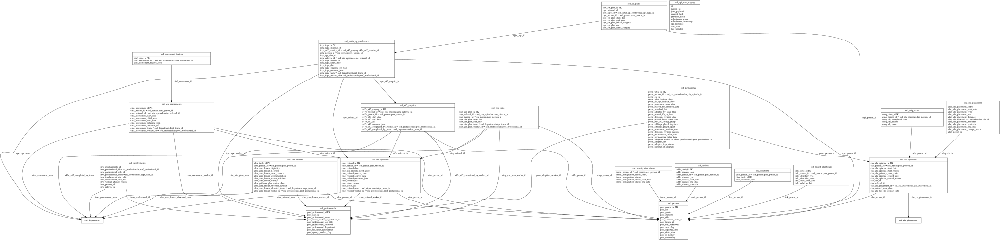

# DFE_PRIVATE_DASHBOARD ERD

[View full image](../assets/images/erd_dfe_private_dashboard.svg)  |  [Download SVG](../assets/images/erd_dfe_private_dashboard.svg)  |  [Download DOT file](../dot/erd_dfe_private_dashboard.dot)

## Table Field Previews

**Tables in domain:** 20

<strong>ssd_address</strong>

<table>
<thead>
<tr><th>Field</th><th>Type</th><th>Notes</th></tr>
</thead>
<tbody>
<tr><td>addr_table_id</td><td>nvarchar</td><td>PK</td></tr>
<tr><td>addr_address_json</td><td>nvarchar</td><td></td></tr>
<tr><td>addr_person_id</td><td>nvarchar</td><td>FK → <a href="#ssd_person">ssd_person</a></td></tr>
<tr><td>addr_address_type</td><td>nvarchar</td><td></td></tr>
<tr><td>addr_address_start_date</td><td>datetime</td><td></td></tr>
<tr><td>addr_address_end_date</td><td>datetime</td><td></td></tr>
<tr><td>addr_address_postcode</td><td>nvarchar</td><td></td></tr>
</tbody>
</table>

<strong>ssd_api_data_staging</strong>

<table>
<thead>
<tr><th>Field</th><th>Type</th><th>Notes</th></tr>
</thead>
<tbody>
<tr><td>id</td><td>nvarchar</td><td></td></tr>
<tr><td>person_id</td><td>nvarchar</td><td></td></tr>
<tr><td>json_payload</td><td>nvarchar</td><td></td></tr>
<tr><td>current_hash</td><td>BINARY</td><td></td></tr>
<tr><td>previous_hash</td><td>BINARY</td><td></td></tr>
<tr><td>submission_status</td><td>nvarchar</td><td></td></tr>
<tr><td>submission_timestamp</td><td>datetime</td><td></td></tr>
<tr><td>api_response</td><td>nvarchar</td><td></td></tr>
<tr><td>row_state</td><td>nvarchar</td><td></td></tr>
<tr><td>last_updated</td><td>datetime</td><td></td></tr>
</tbody>
</table>

<strong>ssd_assessment_factors</strong>

<table>
<thead>
<tr><th>Field</th><th>Type</th><th>Notes</th></tr>
</thead>
<tbody>
<tr><td>cinf_table_id</td><td>nvarchar</td><td>PK</td></tr>
<tr><td>cinf_assessment_id</td><td>nvarchar</td><td>FK → <a href="#ssd_cin_assessments">ssd_cin_assessments</a></td></tr>
<tr><td>cinf_assessment_factors_json</td><td>nvarchar</td><td></td></tr>
</tbody>
</table>

<strong>ssd_care_leavers</strong>

<table>
<thead>
<tr><th>Field</th><th>Type</th><th>Notes</th></tr>
</thead>
<tbody>
<tr><td>clea_table_id</td><td>nvarchar</td><td>PK</td></tr>
<tr><td>clea_person_id</td><td>nvarchar</td><td>FK → <a href="#ssd_person">ssd_person</a></td></tr>
<tr><td>clea_care_leaver_eligibility</td><td>nvarchar</td><td></td></tr>
<tr><td>clea_care_leaver_in_touch</td><td>nvarchar</td><td></td></tr>
<tr><td>clea_care_leaver_latest_contact</td><td>datetime</td><td></td></tr>
<tr><td>clea_care_leaver_accommodation</td><td>nvarchar</td><td></td></tr>
<tr><td>clea_care_leaver_accom_suitable</td><td>nvarchar</td><td></td></tr>
<tr><td>clea_care_leaver_activity</td><td>nvarchar</td><td></td></tr>
<tr><td>clea_pathway_plan_review_date</td><td>datetime</td><td></td></tr>
<tr><td>clea_care_leaver_personal_advisor</td><td>nvarchar</td><td></td></tr>
<tr><td>clea_care_leaver_allocated_team</td><td>nvarchar</td><td>FK → ssd_department</td></tr>
<tr><td>clea_care_leaver_worker_id</td><td>nvarchar</td><td>FK → <a href="#ssd_professionals">ssd_professionals</a></td></tr>
</tbody>
</table>

<strong>ssd_cin_assessments</strong>

<table>
<thead>
<tr><th>Field</th><th>Type</th><th>Notes</th></tr>
</thead>
<tbody>
<tr><td>cina_assessment_id</td><td>nvarchar</td><td>PK</td></tr>
<tr><td>cina_person_id</td><td>nvarchar</td><td>FK → <a href="#ssd_person">ssd_person</a></td></tr>
<tr><td>cina_referral_id</td><td>nvarchar</td><td>FK → <a href="#ssd_cin_episodes">ssd_cin_episodes</a></td></tr>
<tr><td>cina_assessment_start_date</td><td>datetime</td><td></td></tr>
<tr><td>cina_assessment_child_seen</td><td>nchar</td><td></td></tr>
<tr><td>cina_assessment_auth_date</td><td>datetime</td><td></td></tr>
<tr><td>cina_assessment_outcome_json</td><td>nvarchar</td><td></td></tr>
<tr><td>cina_assessment_outcome_nfa</td><td>NCHAR</td><td></td></tr>
<tr><td>cina_assessment_team</td><td>nvarchar</td><td>FK → ssd_department</td></tr>
<tr><td>cina_assessment_worker_id</td><td>nvarchar</td><td>FK → <a href="#ssd_professionals">ssd_professionals</a></td></tr>
</tbody>
</table>

<strong>ssd_cin_episodes</strong>

<table>
<thead>
<tr><th>Field</th><th>Type</th><th>Notes</th></tr>
</thead>
<tbody>
<tr><td>cine_referral_id</td><td>nvarchar</td><td>PK</td></tr>
<tr><td>cine_person_id</td><td>nvarchar</td><td>FK → <a href="#ssd_person">ssd_person</a></td></tr>
<tr><td>cine_referral_date</td><td>datetime</td><td></td></tr>
<tr><td>cine_cin_primary_need_code</td><td>nvarchar</td><td></td></tr>
<tr><td>cine_referral_source_code</td><td>nvarchar</td><td></td></tr>
<tr><td>cine_referral_source_desc</td><td>nvarchar</td><td></td></tr>
<tr><td>cine_referral_outcome_json</td><td>nvarchar</td><td></td></tr>
<tr><td>cine_referral_nfa</td><td>nchar</td><td></td></tr>
<tr><td>cine_close_reason</td><td>nvarchar</td><td></td></tr>
<tr><td>cine_close_date</td><td>datetime</td><td></td></tr>
<tr><td>cine_referral_team</td><td>nvarchar</td><td>FK → ssd_department</td></tr>
<tr><td>cine_referral_worker_id</td><td>nvarchar</td><td>FK → <a href="#ssd_professionals">ssd_professionals</a></td></tr>
</tbody>
</table>

<strong>ssd_cin_plans</strong>

<table>
<thead>
<tr><th>Field</th><th>Type</th><th>Notes</th></tr>
</thead>
<tbody>
<tr><td>cinp_cin_plan_id</td><td>nvarchar</td><td>PK</td></tr>
<tr><td>cinp_referral_id</td><td>nvarchar</td><td>FK → <a href="#ssd_cin_episodes">ssd_cin_episodes</a></td></tr>
<tr><td>cinp_person_id</td><td>nvarchar</td><td>FK → <a href="#ssd_person">ssd_person</a></td></tr>
<tr><td>cinp_cin_plan_start_date</td><td>datetime</td><td></td></tr>
<tr><td>cinp_cin_plan_end_date</td><td>datetime</td><td></td></tr>
<tr><td>cinp_cin_plan_team</td><td>nvarchar</td><td>FK → ssd_department</td></tr>
<tr><td>cinp_cin_plan_worker_id</td><td>nvarchar</td><td>FK → <a href="#ssd_professionals">ssd_professionals</a></td></tr>
</tbody>
</table>

<strong>ssd_cla_episodes</strong>

<table>
<thead>
<tr><th>Field</th><th>Type</th><th>Notes</th></tr>
</thead>
<tbody>
<tr><td>clae_cla_episode_id</td><td>nvarchar</td><td>PK</td></tr>
<tr><td>clae_person_id</td><td>nvarchar</td><td>FK → <a href="#ssd_person">ssd_person</a></td></tr>
<tr><td>clae_cla_episode_start_date</td><td>datetime</td><td></td></tr>
<tr><td>clae_cla_episode_start_reason</td><td>nvarchar</td><td></td></tr>
<tr><td>clae_cla_primary_need_code</td><td>nvarchar</td><td></td></tr>
<tr><td>clae_cla_episode_ceased_date</td><td>datetime</td><td></td></tr>
<tr><td>clae_cla_episode_ceased_reason</td><td>nvarchar</td><td></td></tr>
<tr><td>clae_cla_id</td><td>nvarchar</td><td></td></tr>
<tr><td>clae_referral_id</td><td>nvarchar</td><td></td></tr>
<tr><td>clae_cla_placement_id</td><td>nvarchar</td><td>FK → ssd_cla_placements</td></tr>
<tr><td>clae_entered_care_date</td><td>datetime</td><td></td></tr>
<tr><td>clae_cla_last_iro_contact_date</td><td>datetime</td><td></td></tr>
</tbody>
</table>

<strong>ssd_cla_placement</strong>

<table>
<thead>
<tr><th>Field</th><th>Type</th><th>Notes</th></tr>
</thead>
<tbody>
<tr><td>clap_cla_placement_id</td><td>nvarchar</td><td>PK</td></tr>
<tr><td>clap_cla_placement_start_date</td><td>datetime</td><td></td></tr>
<tr><td>clap_cla_placement_type</td><td>nvarchar</td><td></td></tr>
<tr><td>clap_cla_placement_urn</td><td>nvarchar</td><td></td></tr>
<tr><td>clap_cla_placement_distance</td><td>float</td><td></td></tr>
<tr><td>clap_cla_id</td><td>nvarchar</td><td>FK → <a href="#ssd_cla_episodes">ssd_cla_episodes</a></td></tr>
<tr><td>clap_cla_placement_provider</td><td>nvarchar</td><td></td></tr>
<tr><td>clap_cla_placement_postcode</td><td>nvarchar</td><td></td></tr>
<tr><td>clap_cla_placement_end_date</td><td>datetime</td><td></td></tr>
<tr><td>clap_cla_placement_change_reason</td><td>nvarchar</td><td></td></tr>
<tr><td>clap_person_id</td><td>nvarchar</td><td></td></tr>
</tbody>
</table>

<strong>ssd_cp_plans</strong>

<table>
<thead>
<tr><th>Field</th><th>Type</th><th>Notes</th></tr>
</thead>
<tbody>
<tr><td>cppl_cp_plan_id</td><td>nvarchar</td><td>PK</td></tr>
<tr><td>cppl_referral_id</td><td>nvarchar</td><td></td></tr>
<tr><td>cppl_icpc_id</td><td>nvarchar</td><td>FK → <a href="#ssd_initial_cp_conference">ssd_initial_cp_conference</a></td></tr>
<tr><td>cppl_person_id</td><td>nvarchar</td><td>FK → <a href="#ssd_person">ssd_person</a></td></tr>
<tr><td>cppl_cp_plan_start_date</td><td>datetime</td><td></td></tr>
<tr><td>cppl_cp_plan_end_date</td><td>datetime</td><td></td></tr>
<tr><td>cppl_cp_plan_initial_category</td><td>nvarchar</td><td></td></tr>
<tr><td>cppl_cp_plan_ola</td><td>nchar</td><td></td></tr>
<tr><td>cppl_cp_plan_latest_category</td><td>nvarchar</td><td></td></tr>
</tbody>
</table>

<strong>ssd_disability</strong>

<table>
<thead>
<tr><th>Field</th><th>Type</th><th>Notes</th></tr>
</thead>
<tbody>
<tr><td>disa_person_id</td><td>nvarchar</td><td>FK → <a href="#ssd_person">ssd_person</a></td></tr>
<tr><td>disa_table_id</td><td>nvarchar</td><td>PK</td></tr>
<tr><td>disa_disability_code</td><td>nvarchar</td><td></td></tr>
</tbody>
</table>

<strong>ssd_immigration_status</strong>

<table>
<thead>
<tr><th>Field</th><th>Type</th><th>Notes</th></tr>
</thead>
<tbody>
<tr><td>immi_person_id</td><td>nvarchar</td><td>FK → <a href="#ssd_person">ssd_person</a></td></tr>
<tr><td>immi_immigration_status_id</td><td>nvarchar</td><td>PK</td></tr>
<tr><td>immi_immigration_status</td><td>nvarchar</td><td></td></tr>
<tr><td>immi_immigration_status_start_date</td><td>datetime</td><td></td></tr>
<tr><td>immi_immigration_status_end_date</td><td>datetime</td><td></td></tr>
</tbody>
</table>

<strong>ssd_initial_cp_conference</strong>

<table>
<thead>
<tr><th>Field</th><th>Type</th><th>Notes</th></tr>
</thead>
<tbody>
<tr><td>icpc_icpc_id</td><td>nvarchar</td><td>PK</td></tr>
<tr><td>icpc_icpc_meeting_id</td><td>nvarchar</td><td></td></tr>
<tr><td>icpc_s47_enquiry_id</td><td>nvarchar</td><td>FK → <a href="#ssd_s47_enquiry">ssd_s47_enquiry</a></td></tr>
<tr><td>icpc_person_id</td><td>nvarchar</td><td>FK → <a href="#ssd_person">ssd_person</a></td></tr>
<tr><td>icpc_cp_plan_id</td><td>nvarchar</td><td></td></tr>
<tr><td>icpc_referral_id</td><td>nvarchar</td><td>FK → <a href="#ssd_cin_episodes">ssd_cin_episodes</a></td></tr>
<tr><td>icpc_icpc_transfer_in</td><td>nchar</td><td></td></tr>
<tr><td>icpc_icpc_target_date</td><td>datetime</td><td></td></tr>
<tr><td>icpc_icpc_date</td><td>datetime</td><td></td></tr>
<tr><td>icpc_icpc_outcome_cp_flag</td><td>nchar</td><td></td></tr>
<tr><td>icpc_icpc_outcome_json</td><td>nvarchar</td><td></td></tr>
<tr><td>icpc_icpc_team</td><td>nvarchar</td><td>FK → ssd_department</td></tr>
<tr><td>icpc_icpc_worker_id</td><td>nvarchar</td><td>FK → <a href="#ssd_professionals">ssd_professionals</a></td></tr>
</tbody>
</table>

<strong>ssd_involvements</strong>

<table>
<thead>
<tr><th>Field</th><th>Type</th><th>Notes</th></tr>
</thead>
<tbody>
<tr><td>invo_involvements_id</td><td>nvarchar</td><td></td></tr>
<tr><td>invo_professional_id</td><td>nvarchar</td><td>FK → <a href="#ssd_professionals">ssd_professionals</a></td></tr>
<tr><td>invo_professional_role_id</td><td>nvarchar</td><td></td></tr>
<tr><td>invo_professional_team</td><td>nvarchar</td><td>FK → ssd_department</td></tr>
<tr><td>invo_involvement_start_date</td><td>datetime</td><td></td></tr>
<tr><td>invo_involvement_end_date</td><td>datetime</td><td></td></tr>
<tr><td>invo_worker_change_reason</td><td>nvarchar</td><td></td></tr>
<tr><td>invo_person_id</td><td>nvarchar</td><td></td></tr>
<tr><td>invo_referral_id</td><td>nvarchar</td><td></td></tr>
</tbody>
</table>

<strong>ssd_linked_identifiers</strong>

<table>
<thead>
<tr><th>Field</th><th>Type</th><th>Notes</th></tr>
</thead>
<tbody>
<tr><td>link_table_id</td><td>nvarchar</td><td>PK</td></tr>
<tr><td>link_person_id</td><td>nvarchar</td><td>FK → <a href="#ssd_person">ssd_person</a></td></tr>
<tr><td>link_identifier_type</td><td>nvarchar</td><td></td></tr>
<tr><td>link_identifier_value</td><td>nvarchar</td><td></td></tr>
<tr><td>link_valid_from_date</td><td>datetime</td><td></td></tr>
<tr><td>link_valid_to_date</td><td>datetime</td><td></td></tr>
</tbody>
</table>

<strong>ssd_permanence</strong>

<table>
<thead>
<tr><th>Field</th><th>Type</th><th>Notes</th></tr>
</thead>
<tbody>
<tr><td>perm_table_id</td><td>nvarchar</td><td>PK</td></tr>
<tr><td>perm_person_id</td><td>nvarchar</td><td>FK → <a href="#ssd_cla_episodes">ssd_cla_episodes</a></td></tr>
<tr><td>perm_cla_id</td><td>nvarchar</td><td></td></tr>
<tr><td>perm_adm_decision_date</td><td>datetime</td><td></td></tr>
<tr><td>perm_ffa_cp_decision_date</td><td>datetime</td><td></td></tr>
<tr><td>perm_placement_order_date</td><td>datetime</td><td></td></tr>
<tr><td>perm_placed_for_adoption_date</td><td>datetime</td><td></td></tr>
<tr><td>perm_matched_date</td><td>datetime</td><td></td></tr>
<tr><td>perm_adopted_by_carer_flag</td><td>nchar</td><td></td></tr>
<tr><td>perm_placed_ffa_cp_date</td><td>datetime</td><td></td></tr>
<tr><td>perm_decision_reversed_date</td><td>datetime</td><td></td></tr>
<tr><td>perm_placed_foster_carer_date</td><td>datetime</td><td></td></tr>
<tr><td>perm_part_of_sibling_group</td><td>nchar</td><td></td></tr>
<tr><td>perm_siblings_placed_together</td><td>int</td><td></td></tr>
<tr><td>perm_siblings_placed_apart</td><td>int</td><td></td></tr>
<tr><td>perm_placement_provider_urn</td><td>nvarchar</td><td></td></tr>
<tr><td>perm_decision_reversed_reason</td><td>nvarchar</td><td></td></tr>
<tr><td>perm_permanence_order_date</td><td>datetime</td><td></td></tr>
<tr><td>perm_permanence_order_type</td><td>nvarchar</td><td></td></tr>
<tr><td>perm_adoption_worker_id</td><td>nvarchar</td><td>FK → <a href="#ssd_professionals">ssd_professionals</a></td></tr>
<tr><td>perm_adopter_sex</td><td>nvarchar</td><td></td></tr>
<tr><td>perm_adopter_legal_status</td><td>nvarchar</td><td></td></tr>
<tr><td>perm_number_of_adopters</td><td>nvarchar</td><td></td></tr>
</tbody>
</table>

<strong>ssd_person</strong>

<table>
<thead>
<tr><th>Field</th><th>Type</th><th>Notes</th></tr>
</thead>
<tbody>
<tr><td>pers_person_id</td><td>nvarchar</td><td>PK</td></tr>
<tr><td>pers_sex</td><td>nvarchar</td><td></td></tr>
<tr><td>pers_gender</td><td>nvarchar</td><td></td></tr>
<tr><td>pers_ethnicity</td><td>nvarchar</td><td></td></tr>
<tr><td>pers_dob</td><td>datetime</td><td></td></tr>
<tr><td>pers_common_child_id</td><td>nvarchar</td><td></td></tr>
<tr><td>pers_legacy_id</td><td>nvarchar</td><td></td></tr>
<tr><td>pers_upn_unknown</td><td>nvarchar</td><td></td></tr>
<tr><td>pers_send_flag</td><td>nchar</td><td></td></tr>
<tr><td>pers_expected_dob</td><td>datetime</td><td></td></tr>
<tr><td>pers_death_date</td><td>datetime</td><td></td></tr>
<tr><td>pers_is_mother</td><td>nchar</td><td></td></tr>
<tr><td>pers_nationality</td><td>nvarchar</td><td></td></tr>
</tbody>
</table>

<strong>ssd_professionals</strong>

<table>
<thead>
<tr><th>Field</th><th>Type</th><th>Notes</th></tr>
</thead>
<tbody>
<tr><td>prof_professional_id</td><td>nvarchar</td><td>PK</td></tr>
<tr><td>prof_staff_id</td><td>nvarchar</td><td></td></tr>
<tr><td>prof_professional_name</td><td>nvarchar</td><td></td></tr>
<tr><td>prof_social_worker_registration_no</td><td>nvarchar</td><td></td></tr>
<tr><td>prof_professional_job_title</td><td>nvarchar</td><td></td></tr>
<tr><td>prof_professional_caseload</td><td>int</td><td></td></tr>
<tr><td>prof_professional_department</td><td>nvarchar</td><td></td></tr>
<tr><td>prof_full_time_equivalency</td><td>float</td><td></td></tr>
<tr><td>prof_agency_worker_flag</td><td>NCHAR</td><td></td></tr>
</tbody>
</table>

<strong>ssd_s47_enquiry</strong>

<table>
<thead>
<tr><th>Field</th><th>Type</th><th>Notes</th></tr>
</thead>
<tbody>
<tr><td>s47e_s47_enquiry_id</td><td>nvarchar</td><td>PK</td></tr>
<tr><td>s47e_referral_id</td><td>nvarchar</td><td>FK → <a href="#ssd_cin_episodes">ssd_cin_episodes</a></td></tr>
<tr><td>s47e_person_id</td><td>nvarchar</td><td>FK → <a href="#ssd_person">ssd_person</a></td></tr>
<tr><td>s47e_s47_start_date</td><td>datetime</td><td></td></tr>
<tr><td>s47e_s47_end_date</td><td>datetime</td><td></td></tr>
<tr><td>s47e_s47_nfa</td><td>nchar</td><td></td></tr>
<tr><td>s47e_s47_outcome_json</td><td>nvarchar</td><td></td></tr>
<tr><td>s47e_s47_completed_by_worker_id</td><td>nvarchar</td><td>FK → <a href="#ssd_professionals">ssd_professionals</a></td></tr>
<tr><td>s47e_s47_completed_by_team</td><td>nvarchar</td><td>FK → ssd_department</td></tr>
</tbody>
</table>

<strong>ssd_sdq_scores</strong>

<table>
<thead>
<tr><th>Field</th><th>Type</th><th>Notes</th></tr>
</thead>
<tbody>
<tr><td>csdq_table_id</td><td>nvarchar</td><td>PK</td></tr>
<tr><td>csdq_person_id</td><td>nvarchar</td><td>FK → <a href="#ssd_cla_episodes">ssd_cla_episodes</a></td></tr>
<tr><td>csdq_sdq_completed_date</td><td>datetime</td><td></td></tr>
<tr><td>csdq_sdq_reason</td><td>nvarchar</td><td></td></tr>
<tr><td>csdq_sdq_score</td><td>nvarchar</td><td></td></tr>
</tbody>
</table>

