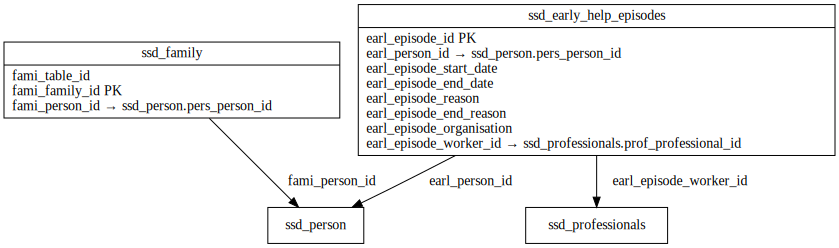

# EARLY_HELP ERD

[View full image](../assets/images/erd_early_help.svg)  |  [Download SVG](../assets/images/erd_early_help.svg)  |  [Download DOT file](../dot/erd_early_help.dot)

## Table Field Previews

**Tables in domain:** 2

<strong>ssd_early_help_episodes</strong>

<table>
<thead>
<tr><th>Field</th><th>Type</th><th>Notes</th></tr>
</thead>
<tbody>
<tr><td>earl_episode_id</td><td>nvarchar</td><td>PK</td></tr>
<tr><td>earl_person_id</td><td>nvarchar</td><td>FK → ssd_person</td></tr>
<tr><td>earl_episode_start_date</td><td>datetime</td><td></td></tr>
<tr><td>earl_episode_end_date</td><td>datetime</td><td></td></tr>
<tr><td>earl_episode_reason</td><td>nvarchar</td><td></td></tr>
<tr><td>earl_episode_end_reason</td><td>nvarchar</td><td></td></tr>
<tr><td>earl_episode_organisation</td><td>nvarchar</td><td></td></tr>
<tr><td>earl_episode_worker_id</td><td>nvarchar</td><td>FK → ssd_professionals</td></tr>
</tbody>
</table>

<strong>ssd_family</strong>

<table>
<thead>
<tr><th>Field</th><th>Type</th><th>Notes</th></tr>
</thead>
<tbody>
<tr><td>fami_table_id</td><td>nvarchar</td><td></td></tr>
<tr><td>fami_family_id</td><td>nvarchar</td><td>PK</td></tr>
<tr><td>fami_person_id</td><td>nvarchar</td><td>FK → ssd_person</td></tr>
</tbody>
</table>

