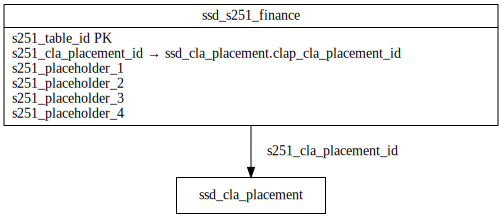

# FINANCE ERD

[View full image](../assets/images/erd_finance.svg)  |  [Download SVG](../assets/images/erd_finance.svg)  |  [Download DOT file](../dot/erd_finance.dot)

## Table Field Previews

**Tables in domain:** 1

<strong>ssd_s251_finance</strong>

<table>
<thead>
<tr><th>Field</th><th>Type</th><th>Notes</th></tr>
</thead>
<tbody>
<tr><td>s251_table_id</td><td>nvarchar</td><td>PK</td></tr>
<tr><td>s251_cla_placement_id</td><td>nvarchar</td><td>FK → ssd_cla_placement</td></tr>
<tr><td>s251_placeholder_1</td><td>nvarchar</td><td></td></tr>
<tr><td>s251_placeholder_2</td><td>nvarchar</td><td></td></tr>
<tr><td>s251_placeholder_3</td><td>nvarchar</td><td></td></tr>
<tr><td>s251_placeholder_4</td><td>nvarchar</td><td></td></tr>
</tbody>
</table>

