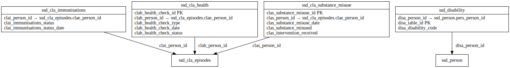

# HEALTH ERD

[View full image](../assets/images/erd_health.svg)  |  [Download SVG](../assets/images/erd_health.svg)  |  [Download DOT file](../dot/erd_health.dot)

## Table Field Previews

**Tables in domain:** 14

<strong>ssd_cla_care_plan</strong>

<table>
<thead>
<tr><th>Field</th><th>Type</th><th>Notes</th></tr>
</thead>
<tbody>
<tr><td>lacp_table_id</td><td>nvarchar</td><td>PK</td></tr>
<tr><td>lacp_person_id</td><td>nvarchar</td><td>FK → <a href="#ssd_cla_episodes">ssd_cla_episodes</a></td></tr>
<tr><td>lacp_cla_care_plan_start_date</td><td>datetime</td><td></td></tr>
<tr><td>lacp_cla_care_plan_end_date</td><td>datetime</td><td></td></tr>
<tr><td>lacp_cla_care_plan_json</td><td>nvarchar</td><td></td></tr>
</tbody>
</table>

<strong>ssd_cla_convictions</strong>

<table>
<thead>
<tr><th>Field</th><th>Type</th><th>Notes</th></tr>
</thead>
<tbody>
<tr><td>clac_cla_conviction_id</td><td>nvarchar</td><td>PK</td></tr>
<tr><td>clac_person_id</td><td>nvarchar</td><td>FK → <a href="#ssd_cla_episodes">ssd_cla_episodes</a></td></tr>
<tr><td>clac_cla_conviction_date</td><td>datetime</td><td></td></tr>
<tr><td>clac_cla_conviction_offence</td><td>nvarchar</td><td></td></tr>
</tbody>
</table>

<strong>ssd_cla_episodes</strong>

<table>
<thead>
<tr><th>Field</th><th>Type</th><th>Notes</th></tr>
</thead>
<tbody>
<tr><td>clae_cla_episode_id</td><td>nvarchar</td><td>PK</td></tr>
<tr><td>clae_person_id</td><td>nvarchar</td><td>FK → ssd_person</td></tr>
<tr><td>clae_cla_episode_start_date</td><td>datetime</td><td></td></tr>
<tr><td>clae_cla_episode_start_reason</td><td>nvarchar</td><td></td></tr>
<tr><td>clae_cla_primary_need_code</td><td>nvarchar</td><td></td></tr>
<tr><td>clae_cla_episode_ceased_date</td><td>datetime</td><td></td></tr>
<tr><td>clae_cla_episode_ceased_reason</td><td>nvarchar</td><td></td></tr>
<tr><td>clae_cla_id</td><td>nvarchar</td><td></td></tr>
<tr><td>clae_referral_id</td><td>nvarchar</td><td></td></tr>
<tr><td>clae_cla_placement_id</td><td>nvarchar</td><td>FK → ssd_cla_placements</td></tr>
<tr><td>clae_entered_care_date</td><td>datetime</td><td></td></tr>
<tr><td>clae_cla_last_iro_contact_date</td><td>datetime</td><td></td></tr>
</tbody>
</table>

<strong>ssd_cla_health</strong>

<table>
<thead>
<tr><th>Field</th><th>Type</th><th>Notes</th></tr>
</thead>
<tbody>
<tr><td>clah_health_check_id</td><td>nvarchar</td><td>PK</td></tr>
<tr><td>clah_person_id</td><td>nvarchar</td><td>FK → <a href="#ssd_cla_episodes">ssd_cla_episodes</a></td></tr>
<tr><td>clah_health_check_type</td><td>nvarchar</td><td></td></tr>
<tr><td>clah_health_check_date</td><td>datetime</td><td></td></tr>
<tr><td>clah_health_check_status</td><td>nvarchar</td><td></td></tr>
</tbody>
</table>

<strong>ssd_cla_immunisations</strong>

<table>
<thead>
<tr><th>Field</th><th>Type</th><th>Notes</th></tr>
</thead>
<tbody>
<tr><td>clai_person_id</td><td>nvarchar</td><td>FK → <a href="#ssd_cla_episodes">ssd_cla_episodes</a></td></tr>
<tr><td>clai_immunisations_status</td><td>nchar</td><td></td></tr>
<tr><td>clai_immunisations_status_date</td><td>datetime</td><td></td></tr>
</tbody>
</table>

<strong>ssd_cla_placement</strong>

<table>
<thead>
<tr><th>Field</th><th>Type</th><th>Notes</th></tr>
</thead>
<tbody>
<tr><td>clap_cla_placement_id</td><td>nvarchar</td><td>PK</td></tr>
<tr><td>clap_cla_placement_start_date</td><td>datetime</td><td></td></tr>
<tr><td>clap_cla_placement_type</td><td>nvarchar</td><td></td></tr>
<tr><td>clap_cla_placement_urn</td><td>nvarchar</td><td></td></tr>
<tr><td>clap_cla_placement_distance</td><td>float</td><td></td></tr>
<tr><td>clap_cla_id</td><td>nvarchar</td><td>FK → <a href="#ssd_cla_episodes">ssd_cla_episodes</a></td></tr>
<tr><td>clap_cla_placement_provider</td><td>nvarchar</td><td></td></tr>
<tr><td>clap_cla_placement_postcode</td><td>nvarchar</td><td></td></tr>
<tr><td>clap_cla_placement_end_date</td><td>datetime</td><td></td></tr>
<tr><td>clap_cla_placement_change_reason</td><td>nvarchar</td><td></td></tr>
<tr><td>clap_person_id</td><td>nvarchar</td><td></td></tr>
</tbody>
</table>

<strong>ssd_cla_previous_permanence</strong>

<table>
<thead>
<tr><th>Field</th><th>Type</th><th>Notes</th></tr>
</thead>
<tbody>
<tr><td>lapp_table_id</td><td>nvarchar</td><td>PK</td></tr>
<tr><td>lapp_person_id</td><td>nvarchar</td><td>FK → <a href="#ssd_cla_episodes">ssd_cla_episodes</a></td></tr>
<tr><td>lapp_previous_permanence_order_date</td><td>nvarchar</td><td></td></tr>
<tr><td>lapp_previous_permanence_option</td><td>nvarchar</td><td></td></tr>
<tr><td>lapp_previous_permanence_la</td><td>nvarchar</td><td></td></tr>
</tbody>
</table>

<strong>ssd_cla_substance_misuse</strong>

<table>
<thead>
<tr><th>Field</th><th>Type</th><th>Notes</th></tr>
</thead>
<tbody>
<tr><td>clas_substance_misuse_id</td><td>nvarchar</td><td>PK</td></tr>
<tr><td>clas_person_id</td><td>nvarchar</td><td>FK → <a href="#ssd_cla_episodes">ssd_cla_episodes</a></td></tr>
<tr><td>clas_substance_misuse_date</td><td>datetime</td><td></td></tr>
<tr><td>clas_substance_misused</td><td>nchar</td><td></td></tr>
<tr><td>clas_intervention_received</td><td>nchar</td><td></td></tr>
</tbody>
</table>

<strong>ssd_disability</strong>

<table>
<thead>
<tr><th>Field</th><th>Type</th><th>Notes</th></tr>
</thead>
<tbody>
<tr><td>disa_person_id</td><td>nvarchar</td><td>FK → ssd_person</td></tr>
<tr><td>disa_table_id</td><td>nvarchar</td><td>PK</td></tr>
<tr><td>disa_disability_code</td><td>nvarchar</td><td></td></tr>
</tbody>
</table>

<strong>ssd_legal_status</strong>

<table>
<thead>
<tr><th>Field</th><th>Type</th><th>Notes</th></tr>
</thead>
<tbody>
<tr><td>lega_legal_status_id</td><td>nvarchar</td><td>PK</td></tr>
<tr><td>lega_person_id</td><td>nvarchar</td><td>FK → ssd_person</td></tr>
<tr><td>lega_legal_status</td><td>nvarchar</td><td></td></tr>
<tr><td>lega_legal_status_start_date</td><td>datetime</td><td></td></tr>
<tr><td>lega_legal_status_end_date</td><td>datetime</td><td></td></tr>
</tbody>
</table>

<strong>ssd_missing</strong>

<table>
<thead>
<tr><th>Field</th><th>Type</th><th>Notes</th></tr>
</thead>
<tbody>
<tr><td>miss_table_id</td><td>nvarchar</td><td>PK</td></tr>
<tr><td>miss_person_id</td><td>nvarchar</td><td>FK → ssd_person</td></tr>
<tr><td>miss_missing_episode_start_date</td><td>datetime</td><td></td></tr>
<tr><td>miss_missing_episode_type</td><td>nvarchar</td><td></td></tr>
<tr><td>miss_missing_episode_end_date</td><td>datetime</td><td></td></tr>
<tr><td>miss_missing_rhi_offered</td><td>nvarchar</td><td></td></tr>
<tr><td>miss_missing_rhi_accepted</td><td>nvarchar</td><td></td></tr>
</tbody>
</table>

<strong>ssd_mother</strong>

<table>
<thead>
<tr><th>Field</th><th>Type</th><th>Notes</th></tr>
</thead>
<tbody>
<tr><td>moth_table_id</td><td>nvarchar</td><td>PK</td></tr>
<tr><td>moth_person_id</td><td>nvarchar</td><td>FK → ssd_person</td></tr>
<tr><td>moth_childs_person_id</td><td>nvarchar</td><td>PK; FK → ssd_person</td></tr>
<tr><td>moth_childs_dob</td><td>datetime</td><td></td></tr>
</tbody>
</table>

<strong>ssd_permanence</strong>

<table>
<thead>
<tr><th>Field</th><th>Type</th><th>Notes</th></tr>
</thead>
<tbody>
<tr><td>perm_table_id</td><td>nvarchar</td><td>PK</td></tr>
<tr><td>perm_person_id</td><td>nvarchar</td><td>FK → <a href="#ssd_cla_episodes">ssd_cla_episodes</a></td></tr>
<tr><td>perm_cla_id</td><td>nvarchar</td><td></td></tr>
<tr><td>perm_adm_decision_date</td><td>datetime</td><td></td></tr>
<tr><td>perm_ffa_cp_decision_date</td><td>datetime</td><td></td></tr>
<tr><td>perm_placement_order_date</td><td>datetime</td><td></td></tr>
<tr><td>perm_placed_for_adoption_date</td><td>datetime</td><td></td></tr>
<tr><td>perm_matched_date</td><td>datetime</td><td></td></tr>
<tr><td>perm_adopted_by_carer_flag</td><td>nchar</td><td></td></tr>
<tr><td>perm_placed_ffa_cp_date</td><td>datetime</td><td></td></tr>
<tr><td>perm_decision_reversed_date</td><td>datetime</td><td></td></tr>
<tr><td>perm_placed_foster_carer_date</td><td>datetime</td><td></td></tr>
<tr><td>perm_part_of_sibling_group</td><td>nchar</td><td></td></tr>
<tr><td>perm_siblings_placed_together</td><td>int</td><td></td></tr>
<tr><td>perm_siblings_placed_apart</td><td>int</td><td></td></tr>
<tr><td>perm_placement_provider_urn</td><td>nvarchar</td><td></td></tr>
<tr><td>perm_decision_reversed_reason</td><td>nvarchar</td><td></td></tr>
<tr><td>perm_permanence_order_date</td><td>datetime</td><td></td></tr>
<tr><td>perm_permanence_order_type</td><td>nvarchar</td><td></td></tr>
<tr><td>perm_adoption_worker_id</td><td>nvarchar</td><td>FK → ssd_professionals</td></tr>
<tr><td>perm_adopter_sex</td><td>nvarchar</td><td></td></tr>
<tr><td>perm_adopter_legal_status</td><td>nvarchar</td><td></td></tr>
<tr><td>perm_number_of_adopters</td><td>nvarchar</td><td></td></tr>
</tbody>
</table>

<strong>ssd_sdq_scores</strong>

<table>
<thead>
<tr><th>Field</th><th>Type</th><th>Notes</th></tr>
</thead>
<tbody>
<tr><td>csdq_table_id</td><td>nvarchar</td><td>PK</td></tr>
<tr><td>csdq_person_id</td><td>nvarchar</td><td>FK → <a href="#ssd_cla_episodes">ssd_cla_episodes</a></td></tr>
<tr><td>csdq_sdq_completed_date</td><td>datetime</td><td></td></tr>
<tr><td>csdq_sdq_reason</td><td>nvarchar</td><td></td></tr>
<tr><td>csdq_sdq_score</td><td>nvarchar</td><td></td></tr>
</tbody>
</table>

