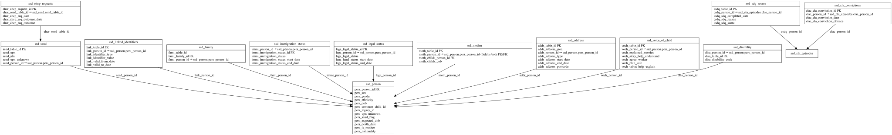

# IDENTITY ERD

[View full image](../assets/images/erd_identity.svg)  |  [Download SVG](../assets/images/erd_identity.svg)  |  [Download DOT file](../dot/erd_identity.dot)

## Table Field Previews

**Tables in domain:** 13

<strong>ssd_address</strong>

<table>
<thead>
<tr><th>Field</th><th>Type</th><th>Notes</th></tr>
</thead>
<tbody>
<tr><td>addr_table_id</td><td>nvarchar</td><td>PK</td></tr>
<tr><td>addr_address_json</td><td>nvarchar</td><td></td></tr>
<tr><td>addr_person_id</td><td>nvarchar</td><td>FK → <a href="#ssd_person">ssd_person</a></td></tr>
<tr><td>addr_address_type</td><td>nvarchar</td><td></td></tr>
<tr><td>addr_address_start_date</td><td>datetime</td><td></td></tr>
<tr><td>addr_address_end_date</td><td>datetime</td><td></td></tr>
<tr><td>addr_address_postcode</td><td>nvarchar</td><td></td></tr>
</tbody>
</table>

<strong>ssd_cla_convictions</strong>

<table>
<thead>
<tr><th>Field</th><th>Type</th><th>Notes</th></tr>
</thead>
<tbody>
<tr><td>clac_cla_conviction_id</td><td>nvarchar</td><td>PK</td></tr>
<tr><td>clac_person_id</td><td>nvarchar</td><td>FK → ssd_cla_episodes</td></tr>
<tr><td>clac_cla_conviction_date</td><td>datetime</td><td></td></tr>
<tr><td>clac_cla_conviction_offence</td><td>nvarchar</td><td></td></tr>
</tbody>
</table>

<strong>ssd_disability</strong>

<table>
<thead>
<tr><th>Field</th><th>Type</th><th>Notes</th></tr>
</thead>
<tbody>
<tr><td>disa_person_id</td><td>nvarchar</td><td>FK → <a href="#ssd_person">ssd_person</a></td></tr>
<tr><td>disa_table_id</td><td>nvarchar</td><td>PK</td></tr>
<tr><td>disa_disability_code</td><td>nvarchar</td><td></td></tr>
</tbody>
</table>

<strong>ssd_ehcp_requests</strong>

<table>
<thead>
<tr><th>Field</th><th>Type</th><th>Notes</th></tr>
</thead>
<tbody>
<tr><td>ehcr_ehcp_request_id</td><td>nvarchar</td><td>PK</td></tr>
<tr><td>ehcr_send_table_id</td><td>nvarchar</td><td>FK → <a href="#ssd_send">ssd_send</a></td></tr>
<tr><td>ehcr_ehcp_req_date</td><td>datetime</td><td></td></tr>
<tr><td>ehcr_ehcp_req_outcome_date</td><td>datetime</td><td></td></tr>
<tr><td>ehcr_ehcp_req_outcome</td><td>nvarchar</td><td></td></tr>
</tbody>
</table>

<strong>ssd_family</strong>

<table>
<thead>
<tr><th>Field</th><th>Type</th><th>Notes</th></tr>
</thead>
<tbody>
<tr><td>fami_table_id</td><td>nvarchar</td><td></td></tr>
<tr><td>fami_family_id</td><td>nvarchar</td><td>PK</td></tr>
<tr><td>fami_person_id</td><td>nvarchar</td><td>FK → <a href="#ssd_person">ssd_person</a></td></tr>
</tbody>
</table>

<strong>ssd_immigration_status</strong>

<table>
<thead>
<tr><th>Field</th><th>Type</th><th>Notes</th></tr>
</thead>
<tbody>
<tr><td>immi_person_id</td><td>nvarchar</td><td>FK → <a href="#ssd_person">ssd_person</a></td></tr>
<tr><td>immi_immigration_status_id</td><td>nvarchar</td><td>PK</td></tr>
<tr><td>immi_immigration_status</td><td>nvarchar</td><td></td></tr>
<tr><td>immi_immigration_status_start_date</td><td>datetime</td><td></td></tr>
<tr><td>immi_immigration_status_end_date</td><td>datetime</td><td></td></tr>
</tbody>
</table>

<strong>ssd_legal_status</strong>

<table>
<thead>
<tr><th>Field</th><th>Type</th><th>Notes</th></tr>
</thead>
<tbody>
<tr><td>lega_legal_status_id</td><td>nvarchar</td><td>PK</td></tr>
<tr><td>lega_person_id</td><td>nvarchar</td><td>FK → <a href="#ssd_person">ssd_person</a></td></tr>
<tr><td>lega_legal_status</td><td>nvarchar</td><td></td></tr>
<tr><td>lega_legal_status_start_date</td><td>datetime</td><td></td></tr>
<tr><td>lega_legal_status_end_date</td><td>datetime</td><td></td></tr>
</tbody>
</table>

<strong>ssd_linked_identifiers</strong>

<table>
<thead>
<tr><th>Field</th><th>Type</th><th>Notes</th></tr>
</thead>
<tbody>
<tr><td>link_table_id</td><td>nvarchar</td><td>PK</td></tr>
<tr><td>link_person_id</td><td>nvarchar</td><td>FK → <a href="#ssd_person">ssd_person</a></td></tr>
<tr><td>link_identifier_type</td><td>nvarchar</td><td></td></tr>
<tr><td>link_identifier_value</td><td>nvarchar</td><td></td></tr>
<tr><td>link_valid_from_date</td><td>datetime</td><td></td></tr>
<tr><td>link_valid_to_date</td><td>datetime</td><td></td></tr>
</tbody>
</table>

<strong>ssd_mother</strong>

<table>
<thead>
<tr><th>Field</th><th>Type</th><th>Notes</th></tr>
</thead>
<tbody>
<tr><td>moth_table_id</td><td>nvarchar</td><td>PK</td></tr>
<tr><td>moth_person_id</td><td>nvarchar</td><td>FK → <a href="#ssd_person">ssd_person</a></td></tr>
<tr><td>moth_childs_person_id</td><td>nvarchar</td><td>PK; FK → <a href="#ssd_person">ssd_person</a></td></tr>
<tr><td>moth_childs_dob</td><td>datetime</td><td></td></tr>
</tbody>
</table>

<strong>ssd_person</strong>

<table>
<thead>
<tr><th>Field</th><th>Type</th><th>Notes</th></tr>
</thead>
<tbody>
<tr><td>pers_person_id</td><td>nvarchar</td><td>PK</td></tr>
<tr><td>pers_sex</td><td>nvarchar</td><td></td></tr>
<tr><td>pers_gender</td><td>nvarchar</td><td></td></tr>
<tr><td>pers_ethnicity</td><td>nvarchar</td><td></td></tr>
<tr><td>pers_dob</td><td>datetime</td><td></td></tr>
<tr><td>pers_common_child_id</td><td>nvarchar</td><td></td></tr>
<tr><td>pers_legacy_id</td><td>nvarchar</td><td></td></tr>
<tr><td>pers_upn_unknown</td><td>nvarchar</td><td></td></tr>
<tr><td>pers_send_flag</td><td>nchar</td><td></td></tr>
<tr><td>pers_expected_dob</td><td>datetime</td><td></td></tr>
<tr><td>pers_death_date</td><td>datetime</td><td></td></tr>
<tr><td>pers_is_mother</td><td>nchar</td><td></td></tr>
<tr><td>pers_nationality</td><td>nvarchar</td><td></td></tr>
</tbody>
</table>

<strong>ssd_sdq_scores</strong>

<table>
<thead>
<tr><th>Field</th><th>Type</th><th>Notes</th></tr>
</thead>
<tbody>
<tr><td>csdq_table_id</td><td>nvarchar</td><td>PK</td></tr>
<tr><td>csdq_person_id</td><td>nvarchar</td><td>FK → ssd_cla_episodes</td></tr>
<tr><td>csdq_sdq_completed_date</td><td>datetime</td><td></td></tr>
<tr><td>csdq_sdq_reason</td><td>nvarchar</td><td></td></tr>
<tr><td>csdq_sdq_score</td><td>nvarchar</td><td></td></tr>
</tbody>
</table>

<strong>ssd_send</strong>

<table>
<thead>
<tr><th>Field</th><th>Type</th><th>Notes</th></tr>
</thead>
<tbody>
<tr><td>send_table_id</td><td>nvarchar</td><td>PK</td></tr>
<tr><td>send_upn</td><td>nvarchar</td><td></td></tr>
<tr><td>send_uln</td><td>nvarchar</td><td></td></tr>
<tr><td>send_upn_unknown</td><td>nvarchar</td><td></td></tr>
<tr><td>send_person_id</td><td>nvarchar</td><td>FK → <a href="#ssd_person">ssd_person</a></td></tr>
</tbody>
</table>

<strong>ssd_voice_of_child</strong>

<table>
<thead>
<tr><th>Field</th><th>Type</th><th>Notes</th></tr>
</thead>
<tbody>
<tr><td>voch_table_id</td><td>nvarchar</td><td>PK</td></tr>
<tr><td>voch_person_id</td><td>nvarchar</td><td>FK → <a href="#ssd_person">ssd_person</a></td></tr>
<tr><td>voch_explained_worries</td><td>nchar</td><td></td></tr>
<tr><td>voch_story_help_understand</td><td>nchar</td><td></td></tr>
<tr><td>voch_agree_worker</td><td>nchar</td><td></td></tr>
<tr><td>voch_plan_safe</td><td>nchar</td><td></td></tr>
<tr><td>voch_tablet_help_explain</td><td>nchar</td><td></td></tr>
</tbody>
</table>

