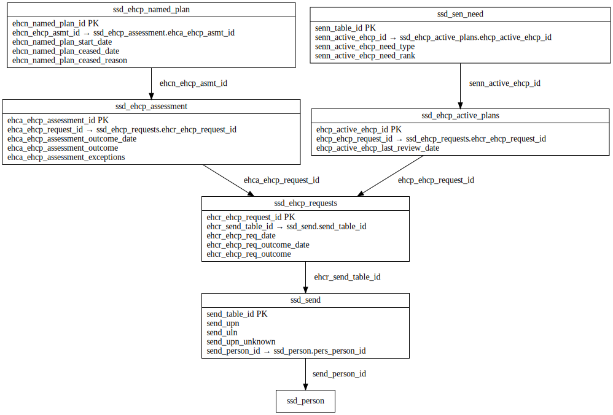

# SEND ERD

[View full image](../assets/images/erd_send.svg)  |  [Download SVG](../assets/images/erd_send.svg)  |  [Download DOT file](../dot/erd_send.dot)

## Table Field Previews

**Tables in domain:** 6

<strong>ssd_ehcp_active_plans</strong>

<table>
<thead>
<tr><th>Field</th><th>Type</th><th>Notes</th></tr>
</thead>
<tbody>
<tr><td>ehcp_active_ehcp_id</td><td>nvarchar</td><td>PK</td></tr>
<tr><td>ehcp_ehcp_request_id</td><td>nvarchar</td><td>FK → <a href="#ssd_ehcp_requests">ssd_ehcp_requests</a></td></tr>
<tr><td>ehcp_active_ehcp_last_review_date</td><td>datetime</td><td></td></tr>
</tbody>
</table>

<strong>ssd_ehcp_assessment</strong>

<table>
<thead>
<tr><th>Field</th><th>Type</th><th>Notes</th></tr>
</thead>
<tbody>
<tr><td>ehca_ehcp_assessment_id</td><td>nvarchar</td><td>PK</td></tr>
<tr><td>ehca_ehcp_request_id</td><td>nvarchar</td><td>FK → <a href="#ssd_ehcp_requests">ssd_ehcp_requests</a></td></tr>
<tr><td>ehca_ehcp_assessment_outcome_date</td><td>datetime</td><td></td></tr>
<tr><td>ehca_ehcp_assessment_outcome</td><td>nvarchar</td><td></td></tr>
<tr><td>ehca_ehcp_assessment_exceptions</td><td>nvarchar</td><td></td></tr>
</tbody>
</table>

<strong>ssd_ehcp_named_plan</strong>

<table>
<thead>
<tr><th>Field</th><th>Type</th><th>Notes</th></tr>
</thead>
<tbody>
<tr><td>ehcn_named_plan_id</td><td>nvarchar</td><td>PK</td></tr>
<tr><td>ehcn_ehcp_asmt_id</td><td>nvarchar</td><td>FK → <a href="#ssd_ehcp_assessment">ssd_ehcp_assessment</a></td></tr>
<tr><td>ehcn_named_plan_start_date</td><td>datetime</td><td></td></tr>
<tr><td>ehcn_named_plan_ceased_date</td><td>datetime</td><td></td></tr>
<tr><td>ehcn_named_plan_ceased_reason</td><td>nvarchar</td><td></td></tr>
</tbody>
</table>

<strong>ssd_ehcp_requests</strong>

<table>
<thead>
<tr><th>Field</th><th>Type</th><th>Notes</th></tr>
</thead>
<tbody>
<tr><td>ehcr_ehcp_request_id</td><td>nvarchar</td><td>PK</td></tr>
<tr><td>ehcr_send_table_id</td><td>nvarchar</td><td>FK → <a href="#ssd_send">ssd_send</a></td></tr>
<tr><td>ehcr_ehcp_req_date</td><td>datetime</td><td></td></tr>
<tr><td>ehcr_ehcp_req_outcome_date</td><td>datetime</td><td></td></tr>
<tr><td>ehcr_ehcp_req_outcome</td><td>nvarchar</td><td></td></tr>
</tbody>
</table>

<strong>ssd_sen_need</strong>

<table>
<thead>
<tr><th>Field</th><th>Type</th><th>Notes</th></tr>
</thead>
<tbody>
<tr><td>senn_table_id</td><td>nvarchar</td><td>PK</td></tr>
<tr><td>senn_active_ehcp_id</td><td>nvarchar</td><td>FK → <a href="#ssd_ehcp_active_plans">ssd_ehcp_active_plans</a></td></tr>
<tr><td>senn_active_ehcp_need_type</td><td>nvarchar</td><td></td></tr>
<tr><td>senn_active_ehcp_need_rank</td><td>nchar</td><td></td></tr>
</tbody>
</table>

<strong>ssd_send</strong>

<table>
<thead>
<tr><th>Field</th><th>Type</th><th>Notes</th></tr>
</thead>
<tbody>
<tr><td>send_table_id</td><td>nvarchar</td><td>PK</td></tr>
<tr><td>send_upn</td><td>nvarchar</td><td></td></tr>
<tr><td>send_uln</td><td>nvarchar</td><td></td></tr>
<tr><td>send_upn_unknown</td><td>nvarchar</td><td></td></tr>
<tr><td>send_person_id</td><td>nvarchar</td><td>FK → ssd_person</td></tr>
</tbody>
</table>

