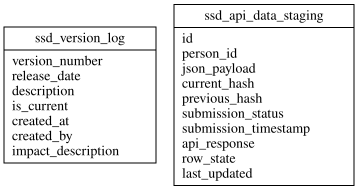

# SSD_ADMIN ERD

[View full image](../assets/images/erd_ssd_admin.svg)  |  [Download SVG](../assets/images/erd_ssd_admin.svg)  |  [Download DOT file](../dot/erd_ssd_admin.dot)

## Table Field Previews

**Tables in domain:** 2

<strong>ssd_api_data_staging</strong>

<table>
<thead>
<tr><th>Field</th><th>Type</th><th>Notes</th></tr>
</thead>
<tbody>
<tr><td>id</td><td>nvarchar</td><td></td></tr>
<tr><td>person_id</td><td>nvarchar</td><td></td></tr>
<tr><td>json_payload</td><td>nvarchar</td><td></td></tr>
<tr><td>current_hash</td><td>BINARY</td><td></td></tr>
<tr><td>previous_hash</td><td>BINARY</td><td></td></tr>
<tr><td>submission_status</td><td>nvarchar</td><td></td></tr>
<tr><td>submission_timestamp</td><td>datetime</td><td></td></tr>
<tr><td>api_response</td><td>nvarchar</td><td></td></tr>
<tr><td>row_state</td><td>nvarchar</td><td></td></tr>
<tr><td>last_updated</td><td>datetime</td><td></td></tr>
</tbody>
</table>

<strong>ssd_version_log</strong>

<table>
<thead>
<tr><th>Field</th><th>Type</th><th>Notes</th></tr>
</thead>
<tbody>
<tr><td>version_number</td><td>nvarchar</td><td></td></tr>
<tr><td>release_date</td><td>Datetime</td><td></td></tr>
<tr><td>description</td><td>nvarchar</td><td></td></tr>
<tr><td>is_current</td><td>Bit</td><td></td></tr>
<tr><td>created_at</td><td>Datetime</td><td></td></tr>
<tr><td>created_by</td><td>nvarchar</td><td></td></tr>
<tr><td>impact_description</td><td>nvarchar</td><td></td></tr>
</tbody>
</table>

