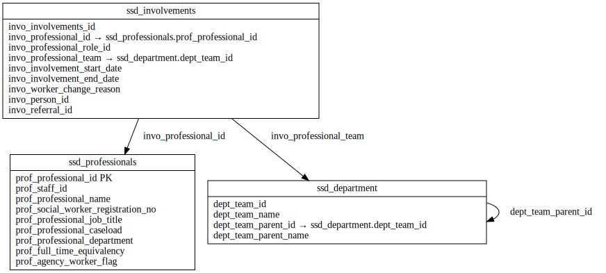

# WORKFORCE ERD

[View full image](../assets/images/erd_workforce.svg)  |  [Download SVG](../assets/images/erd_workforce.svg)  |  [Download DOT file](../dot/erd_workforce.dot)

## Table Field Previews

**Tables in domain:** 3

<strong>ssd_department</strong>

<table>
<thead>
<tr><th>Field</th><th>Type</th><th>Notes</th></tr>
</thead>
<tbody>
<tr><td>dept_team_id</td><td>nvarchar</td><td></td></tr>
<tr><td>dept_team_name</td><td>nvarchar</td><td></td></tr>
<tr><td>dept_team_parent_id</td><td>nvarchar</td><td>FK → <a href="#ssd_department">ssd_department</a></td></tr>
<tr><td>dept_team_parent_name</td><td>nvarchar</td><td></td></tr>
</tbody>
</table>

<strong>ssd_involvements</strong>

<table>
<thead>
<tr><th>Field</th><th>Type</th><th>Notes</th></tr>
</thead>
<tbody>
<tr><td>invo_involvements_id</td><td>nvarchar</td><td></td></tr>
<tr><td>invo_professional_id</td><td>nvarchar</td><td>FK → <a href="#ssd_professionals">ssd_professionals</a></td></tr>
<tr><td>invo_professional_role_id</td><td>nvarchar</td><td></td></tr>
<tr><td>invo_professional_team</td><td>nvarchar</td><td>FK → <a href="#ssd_department">ssd_department</a></td></tr>
<tr><td>invo_involvement_start_date</td><td>datetime</td><td></td></tr>
<tr><td>invo_involvement_end_date</td><td>datetime</td><td></td></tr>
<tr><td>invo_worker_change_reason</td><td>nvarchar</td><td></td></tr>
<tr><td>invo_person_id</td><td>nvarchar</td><td></td></tr>
<tr><td>invo_referral_id</td><td>nvarchar</td><td></td></tr>
</tbody>
</table>

<strong>ssd_professionals</strong>

<table>
<thead>
<tr><th>Field</th><th>Type</th><th>Notes</th></tr>
</thead>
<tbody>
<tr><td>prof_professional_id</td><td>nvarchar</td><td>PK</td></tr>
<tr><td>prof_staff_id</td><td>nvarchar</td><td></td></tr>
<tr><td>prof_professional_name</td><td>nvarchar</td><td></td></tr>
<tr><td>prof_social_worker_registration_no</td><td>nvarchar</td><td></td></tr>
<tr><td>prof_professional_job_title</td><td>nvarchar</td><td></td></tr>
<tr><td>prof_professional_caseload</td><td>int</td><td></td></tr>
<tr><td>prof_professional_department</td><td>nvarchar</td><td></td></tr>
<tr><td>prof_full_time_equivalency</td><td>float</td><td></td></tr>
<tr><td>prof_agency_worker_flag</td><td>NCHAR</td><td></td></tr>
</tbody>
</table>

